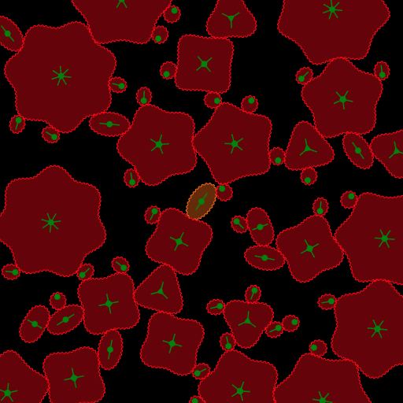
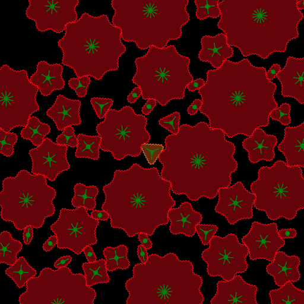
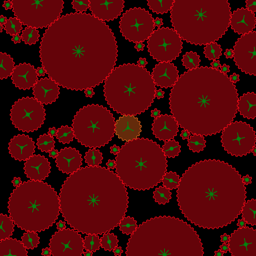
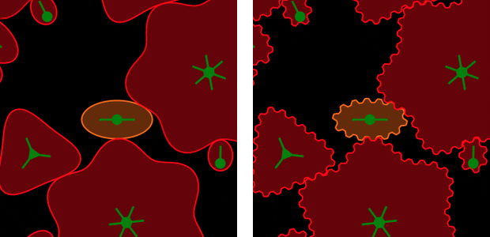

# non-circular-gears
Gears are not always round. Non-circular gears were sketched by Leonardo da Vinci back in the 15th century. Such gears are designed to convert rotational speed in a nonconstant manner. They also look cool.

This project is a non-circular gears system generator: the central gear in orange has an unusual shape, and all the other gears in red are built to accomodate it. All of them have a fixed rotation axis in green. You can also add more gears with the left mouse button.

See it live [here](https://piellardj.github.io/non-circular-gears/).

## Preview

## Explanations

The theory for this project was partially inspired by the excellent Kisssoft paper by Dr. Aljaž Pogačnik. You can find documents in the `\src\research` folder.

### Base idea

Each gear is described in polar coordinates: for each angle, a radius. The main gear can be any function if the radius variations are not too fast. The other gears are built around it to accomodate this geometry.

In a nutshell, the 3 principles are:
- the gears are  always in contact
- the gears roll without slipping
- the gear ratio is non-constant, since the radii vary with the angle

This is explained more precisely in the research papers.

For computation, the gears are simplified to their operating pitch lines. The teeth are only added for the rendering.

    
    

        <i>Operating lines on the left. Same gears with teeth added for rendering on the right.</i>
    

Obviously, this is a great simplification, since in real life such gears require very precise teeth shapes to work together.